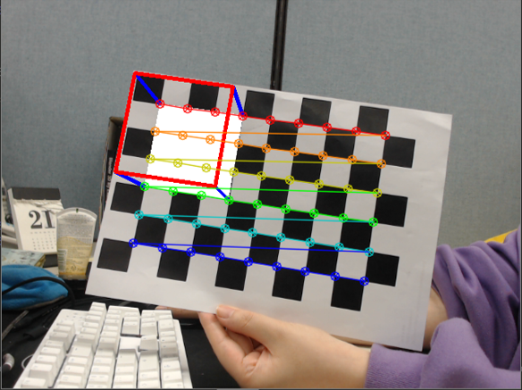
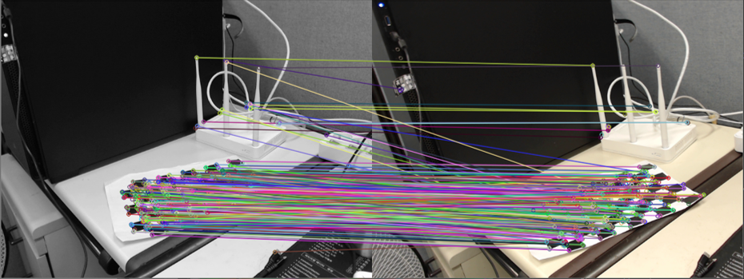

# TwoViewGeometry


## AR Cube




## Triangulation




## Preparation
- USB Web cam 
- 6x8 Checker board
If you'd like to change checker board size, modify the size value at each code. 

## Install dependencies

```
python -m pip install -r requirements.txt
```
This code was tested with python 3.6.7


## Result 

### AR Cube 


### Triangulation


## Reference
